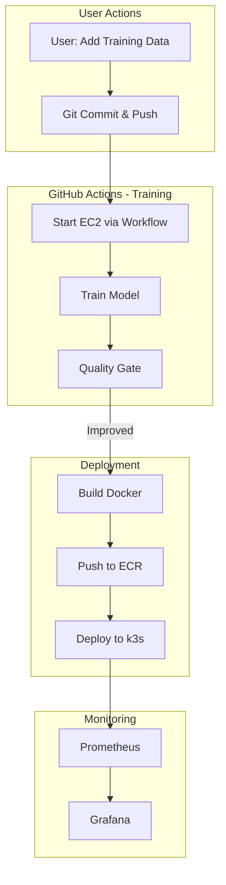
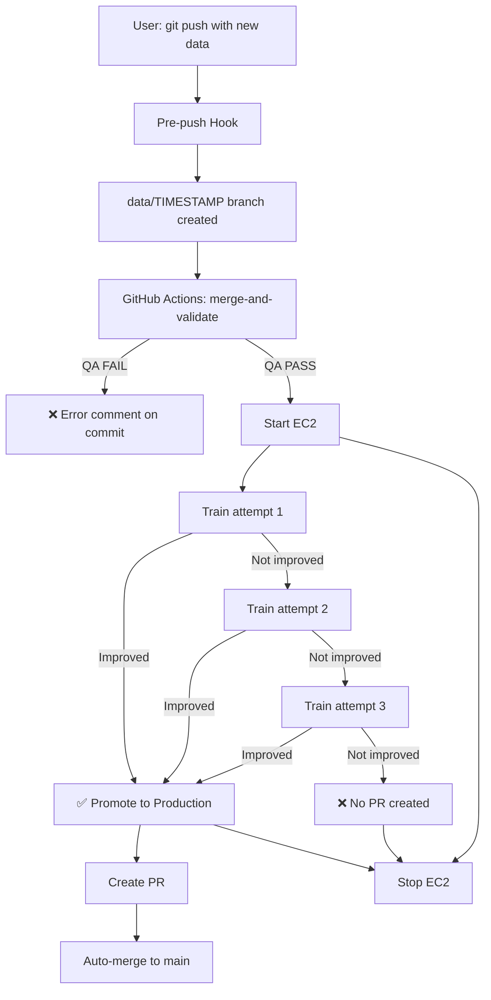

# Water Meters Segmentation - Automated ML Pipeline

[](https://github.com/Rafallost/Water-Meters-Segmentation-Autimatization/actions)

**Automated ML training and deployment pipeline for water meter segmentation using U-Net**

> **👉 Just cloned this repo? Start here:** [QUICKSTART.md](QUICKSTART.md) - Download the model first!

This project demonstrates DevOps best practices applied to machine learning, featuring:
- ✅ Automated data validation and versioning
- ✅ Automated data merging (existing S3 data + new data)
- ✅ Ephemeral infrastructure (70% cost savings)
- ✅ Quality-gated training pipeline (single run, time-optimized)
- ✅ MLflow experiment tracking and model registry
- ✅ Infrastructure as Code (Terraform)

**Bachelor's Thesis Project:** "Application of DevOps Techniques in Implementing Automatic CI/CD Process for Training and Versioning AI Models"

---

## ⚠️ Important: First Time Setup

**Models are NOT stored in Git!** After cloning this repository, you must download the Production model from MLflow:

```bash
# One-time setup after git clone:

# Option 1: AWS CLI (Simpler - recommended!)
python WMS/scripts/sync_model_aws.py
# Windows: just double-click sync_model_aws.bat

# Option 2: GitHub CLI (if configured)
python WMS/scripts/sync_model.py
# Windows: just double-click sync_model.bat

# Both will:
# 1. Start EC2 instance (via GitHub Actions)
# 2. Download Production model from MLflow
# 3. Save to WMS/models/production.pth (gitignored, local cache)
# 4. Stop EC2 instance

# Now you can run predictions offline!
python WMS/src/predicts.py
```

**Why not in Git?**
- ✅ Keeps repository lightweight (models are 7+ MB, can grow to GB)
- ✅ Fast git clone/pull operations (no large binary files)
- ✅ MLflow is single source of truth for model versions
- ✅ Industry-standard MLOps practice (model registry pattern)
- ✅ No Git merge conflicts with binary files

**Note:** Model is cached locally after download. You only need to re-download when a new model is trained.

---

## 🚀 Quick Start

### For Users: Upload New Training Data

```bash
# 1. Add your images and masks
cp /path/to/new/*.jpg WMS/data/training/images/
cp /path/to/new/*.png WMS/data/training/masks/

# 2. Commit and push (hook auto-creates branch!)
git add WMS/data/training/
git commit -m "data: add new training samples"
git push origin main  # Pre-push hook redirects to data/TIMESTAMP

# 3. Wait ~10 minutes for training
# 4. Check PR for training results
# 5. Merge if model improved!

# 6. Download the new Production model
python WMS/scripts/sync_model_aws.py --force  # Re-download latest version
# Windows: double-click sync_model_aws.bat

# 7. Use it for predictions
python WMS/src/predicts.py
```

**When to re-download model:**
- ✅ After first `git clone` (required - see First Time Setup above)
- ✅ After merging PR with improved model (optional - to get latest version)
- ❌ NOT needed after every `git pull/push` (model cached locally)
- ❌ NOT stored in Git (downloaded from MLflow on-demand)

👉 **[Full model usage guide](docs/USAGE.md#-using-the-production-model-locally)**

**How it works:** Pre-push hook detects training data changes and automatically:
- Creates branch `data/YYYYMMDD-HHMMSS` with only your new files
- Pushes to branch (not to main)
- GitHub Actions then: downloads existing S3 data, merges with new, validates, trains, auto-merges if improved

👉 **[How hooks work](docs/BRANCH_PROTECTION.md#-two-layer-protection-system)**

**That's it!** The system handles:
- Data merging (existing + new = complete dataset)
- Data validation
- Model training on **full dataset** (single run, faster)
- Quality comparison against Production baseline
- Model promotion to MLflow
- Auto-approval if model improves

👉 **[Full usage guide](docs/USAGE.md)**
👉 **[Data management guide](devops/DATA_MANAGEMENT.md)** - DVC, S3, and automated workflows

---

## 🛠️ Model Management Commands

Quick reference for working with ML models:

### Download Model from MLflow

```bash
# Download Production model (first time or after new training)
python WMS/scripts/sync_model_aws.py

# Options:
python WMS/scripts/sync_model_aws.py --force      # Re-download even if cached
python WMS/scripts/sync_model_aws.py --no-stop    # Keep EC2 running after download
```

**What it does:**
- ✅ Starts EC2 instance (if stopped)
- ✅ Waits for MLflow to be ready (~2-5 min)
- ✅ Downloads Production model to `WMS/models/production.pth`
- ✅ Asks if you want to stop EC2 (saves costs)

### Run Predictions

```bash
# Run predictions using downloaded model
python WMS/src/predicts.py

# Place images in: WMS/data/predictions/photos_to_predict/
# Results saved to: WMS/data/predictions/predicted_masks/
```

**Requirements:** Model must be downloaded first (see above)

### Check Model Metrics

```bash
# Quick view (no EC2 needed!)
cat WMS/models/production_current.json

# Or detailed view (requires EC2)
python WMS/scripts/show_metrics.py

# Show all model versions and their metrics
python WMS/scripts/show_metrics.py --all

# View metrics history
cat WMS/models/production_history.jsonl
```

**Output:**
- Dice score, IoU, Loss metrics
- Training parameters (LR, batch size, epochs)
- Quality assessment (Excellent/Good/Mediocre/Poor)
- All versions with timestamps
- **NEW:** Metrics tracked in Git (no EC2 needed!)

### Manage Model Versions

```bash
# Check which models exist and their stages
python WMS/scripts/check_model.py

# Promote a specific version to Production (interactive)
# Script will ask for confirmation before promoting
```

**Use cases:**
- See all model versions (1-14 in your case)
- Check which version is in Production stage
- Manually promote a model to Production

### Browse Models in MLflow UI

```bash
# 1. Start EC2 (if not running)
python WMS/scripts/sync_model_aws.py --no-stop

# 2. Open browser: http://100.49.195.150:5000
#    - Click "Models" → "water-meter-segmentation"
#    - See all versions with full metrics and artifacts
#    - View training curves and model parameters
```

---

## ☁️ Cloud Deployment

Deploy the application to AWS EC2 for live inference and demos.

### Deploy to Cloud

```bash
# Start infrastructure and deploy application
./devops/scripts/deploy-to-cloud.sh

# This will:
# 1. Start EC2 instance with Terraform
# 2. Wait for MLflow server to be ready
# 3. Provide access URLs for services
```

**Access your services:**
- 📊 **MLflow UI**: `http://<EC2_IP>:5000` - Track experiments, view models
- 🌐 **Web App**: `http://<EC2_IP>:8000` - Run inference (if deployed)
- 📖 **API Docs**: `http://<EC2_IP>:8000/docs` - Interactive API documentation

**What gets deployed:**
- MLflow tracking server (always running)
- Model serving API (if Helm charts configured)
- k3s cluster for Kubernetes deployment

### Stop Infrastructure (Important!)

```bash
# ALWAYS stop infrastructure when done to save costs!
./devops/scripts/stop-cloud.sh

# This destroys all EC2 resources and stops billing
```

**💰 Cost Reminder:**
- Running infrastructure costs ~$0.10/hour
- Don't forget to shut down after demos/testing
- Infrastructure is ephemeral - designed for on-demand usage

### Manual Deployment vs. Auto-Deployment

**Auto-deployment (in CI/CD):**
- Happens automatically when model improves
- Quick smoke test (~2 minutes)
- EC2 shuts down immediately after
- Purpose: Validates deployment works

**Manual deployment (for usage):**
- Use `./devops/scripts/deploy-to-cloud.sh`
- Keeps running as long as you need
- For demos, testing, and development
- You control when to shut down

### Typical Workflow

```bash
# 1. Deploy infrastructure
./devops/scripts/deploy-to-cloud.sh

# 2. Use the application
# - Test inference via Web UI or API
# - View experiments in MLflow
# - Demo to stakeholders

# 3. Stop infrastructure when done
./devops/scripts/stop-cloud.sh
```

👉 **[Infrastructure architecture](devops/PLAN.md#ec2-based-architecture)**
👉 **[Deployment troubleshooting](KNOWN_ISSUES.md)**

---

## 📚 Documentation

**[→ Full Documentation Index](docs/README.md)** 📖

### Quick Access:

| Document | Description | When to Read |
|----------|-------------|--------------|
| **[WORKFLOWS.md](docs/WORKFLOWS.md)** | ⭐ **Start here!** All pipelines explained | Understanding the system |
| **[USAGE.md](docs/USAGE.md)** | Step-by-step how-to guide | Daily operations |
| **[DIAGRAMS.md](docs/DIAGRAMS.md)** | 🎨 Visual system diagrams (10 Mermaid charts) | Visual learners, thesis |
| **[ARCHITECTURE.md](docs/ARCHITECTURE.md)** | System design & components | Deep dive |
| **[MONITORING.md](docs/MONITORING.md)** | Prometheus + Grafana setup | Observability & testing |
| **[CREDENTIALS.md](docs/CREDENTIALS.md)** | 🔐 AWS credentials management | Local development setup |
| **[BRANCH_PROTECTION.md](docs/BRANCH_PROTECTION.md)** | GitHub setup guide | One-time setup |

**For Developers:**
- [Implementation Plan](devops/PLAN.md) - Development phases
- [Data Management Guide](devops/DATA_MANAGEMENT.md) - DVC, S3, automated workflows
- [Terraform Docs](devops/terraform/README.md) - Infrastructure
- [Tests Guide](WMS/tests/README.md) - Unit tests
- [Scripts README](WMS/scripts/README.md) - Model management tools

**For AI Assistants:**
- [CLAUDE.md](devops/CLAUDE.md) - Project context and rules

---

## 🗺️ Architecture Diagrams

The full architecture pack is available in **[docs/DIAGRAMS.md](docs/DIAGRAMS.md)** (10 Mermaid diagrams), including:
- End-to-end CI/CD + MLOps flow
- Training pipeline and quality gate logic
- Local prediction workflow
- MLflow model versioning lifecycle
- C4 system context and component architecture
- Data flow and monitoring stack
- Cost optimization timeline

Quick architecture preview:



---

## 🏗️ System Overview

```
User → Upload Data → Data QA → Training (EC2 auto-start)
  → Quality Gate → Model Promotion → Deploy to k3s
  → EC2 auto-stop → Merge PR
```

### Key Features

**Ephemeral Infrastructure**
- EC2 instance only runs during training (~10 min)
- Cost: ~$4/month instead of ~$18/month (70% savings)
- Fully automated start/stop via GitHub Actions

**Quality-Gated Training**
- Up to 3 training attempts (different seeds), stops early if model improves
- Compares to dynamic baseline fetched from MLflow Production model
- Auto-promotes model to MLflow Production if improved
- PR created and auto-merged only if model improved

**Data Versioning**
- DVC integration with S3 backend
- Git tracks metadata, S3 stores large files
- POC mode: Small datasets tracked in Git directly

**Experiment Tracking**
- MLflow server on EC2
- Tracks metrics, hyperparameters, artifacts
- Model registry with versioning (Staging/Production)

---

## 🧠 Model Architecture

**U-Net for Semantic Segmentation**

```
Input: 512×512 RGB image (water meter photo)
  ↓
Encoder (4 levels): 16→32→64→128→256 channels
  ↓
Bottleneck: 256 channels
  ↓
Decoder (4 levels) + skip connections
  ↓
Output: 512×512 binary mask (meter region)
```

| Metric | Baseline (v1) | Current Best |
|--------|---------------|--------------|
| **Dice Coefficient** | 0.9275 | _(depends on training)_ |
| **IoU** | 0.8865 | _(depends on training)_ |
| **Parameters** | 1,965,569 | 1,965,569 |
| **Model Size** | 7.6 MB | 7.6 MB |

**Framework:** PyTorch
**Architecture:** Enhanced U-Net [(Ronneberger et al., 2015)](https://arxiv.org/abs/1505.04597)

---

## 🔄 Workflows

| Workflow | Purpose | Trigger | Duration |
|----------|---------|---------|----------|
| **training-data-pipeline.yaml** | Full pipeline: merge data → validate → train → PR | Push to `data/*` | ~15-30 min |
| **ec2-control.yaml** | Start/stop EC2 infrastructure | Called by training pipeline | ~30 sec |
| **train.yml** | Manual training (no data changes) | `workflow_dispatch` only | ~15 min |

👉 **[Detailed workflow explanations](docs/WORKFLOWS.md)**

---

## 🛠️ Technology Stack

| Layer | Technology |
|-------|-----------|
| **ML Framework** | PyTorch |
| **Experiment Tracking** | MLflow |
| **Data Versioning** | DVC + S3 |
| **Infrastructure** | AWS (EC2, S3, ECR) |
| **IaC** | Terraform |
| **Container Orchestration** | k3s (lightweight Kubernetes) |
| **CI/CD** | GitHub Actions |
| **Deployment** | Helm + Docker + ECR |
| **Monitoring** | Prometheus + Grafana |

---

## 💰 Cost Breakdown

**Current (with ephemeral infrastructure):**
- EC2 (t3.large, ephemeral): ~$1-2/month
- S3 storage: ~$1/month
- **Total: ~$3/month**
- Note: t3.xlarge (16GB) recommended for production, but AWS Academy limits to t3.large (8GB)

**Traditional (24/7 EC2):**
- EC2 (t3.large, always on): ~$7.50/month
- S3 storage: ~$1/month
- **Total: ~$10/month**

**Savings: 70-80%**

👉 **[Architecture details](docs/ARCHITECTURE.md)**

---

## 🎯 Core Flow



---

## 📊 Project Status

| Phase | Status | Description |
|-------|--------|-------------|
| Phase 1: Data Foundation | ✅ Complete | DVC, data QA scripts |
| Phase 2: Core Scripts | ✅ Complete | Validation, quality gates |
| Phase 3: GitHub Workflows | ✅ Complete | All pipelines implemented |
| Phase 4: Infrastructure | ✅ Complete | Terraform, EC2, MLflow, k3s |
| Phase 5: Training Pipeline | ✅ Complete | Ephemeral training with quality gates |
| Phase 6: Deployment | ✅ Complete | Docker + ECR + k3s + Helm |
| Phase 7: Documentation | ✅ Complete | Comprehensive docs |
| Phase 8: Monitoring | ✅ Complete | Prometheus + Grafana + ServiceMonitor |
| Phase 9: Thesis Writing | 🚧 In Progress | Comparative analysis & documentation |

---

## 🚦 Getting Started

### Prerequisites

- **AWS Account** (AWS Academy Learner Lab for students)
- **GitHub Account**
- **Local Tools:**
  - Python 3.12+
  - Git
  - AWS CLI v2
  - Terraform 1.0+

### Initial Setup

```bash
# 1. Clone repository with submodules
git clone --recurse-submodules https://github.com/Rafallost/Water-Meters-Segmentation-Autimatization.git
cd Water-Meters-Segmentation-Autimatization

# 2. Install pre-push hook (for automatic data branch creation)
./devops/scripts/install-git-hooks.sh

# 3. Configure GitHub Secrets (for CI/CD workflows)
# Go to: Settings → Secrets and variables → Actions
# Add: AWS_ACCESS_KEY_ID, AWS_SECRET_ACCESS_KEY, AWS_SESSION_TOKEN

# 4. (Optional) For manual deployment/testing only:
# Configure AWS credentials locally
aws configure
# Or for AWS Academy: Update ~/.aws/credentials with session credentials

# 5. (Optional) Deploy infrastructure for testing
cd devops/terraform
terraform init
terraform apply
```

👉 **[Detailed setup guide](docs/SETUP.md)** _(TODO)_
👉 **[Self-hosted runner setup](devops/RUNNER_SETUP.md)** (required for deployment)

---

## 📈 Training Results

Training metrics are logged to MLflow and posted as PR comments.

**Example successful training:**

```
## ✅ Training Results

📈 MODEL IMPROVED (attempt 1/3)

| Metric | New Model | Production Baseline |
|--------|-----------|---------------------|
| Dice   | 0.9350    | 0.9275              |
| IoU    | 0.8920    | 0.8865              |

🚀 Model promoted to Production. PR auto-merged.
```

Access MLflow UI: `http://<EC2_IP>:5000` (when EC2 is running)

---

## 🐛 Troubleshooting

### Common Issues

**"Data QA failed - Non-binary mask values"**
- Masks must contain only 0 and 255
- Convert JPG masks to PNG to avoid compression artifacts
- Run `python devops/scripts/data-qa.py WMS/data/training/` locally

**"Training failed - All 3 attempts"**
- Model didn't improve over baseline
- Check if new data is sufficient/correct
- Review training logs in GitHub Actions

**"AWS credentials expired" (in GitHub Actions)**
- AWS Academy credentials expire every 4 hours
- Update GitHub Secrets: Settings → Secrets → Actions
- **No local AWS credentials needed** for data uploads!

**"EC2 costs too high"**
- Ensure ephemeral infrastructure is working
- Run `devops/scripts/cleanup-aws.sh` when done

👉 **[Full troubleshooting guide](docs/USAGE.md#-troubleshooting)**

---

## 🧹 Cleanup

**IMPORTANT:** Run this when you're done to avoid AWS costs:

```bash
cd devops
bash scripts/cleanup-aws.sh
```

This will:
- Stop EC2 instance
- Empty S3 buckets
- Destroy all Terraform-managed resources

---

## 📁 Repository Structure

```
Water-Meters-Segmentation-Autimatization/
├── WMS/                          # ML code and data
│   ├── src/                      # Training, inference scripts
│   │   ├── train.py              # Main training script
│   │   ├── model.py              # U-Net architecture
│   │   ├── dataset.py            # Data loading
│   │   └── prepareDataset.py     # Data splitting
│   ├── data/
│   │   └── training/             # Training data (Git/DVC)
│   │       ├── images/           # Input photos
│   │       ├── masks/            # Ground truth masks
│   │       └── *.dvc             # DVC metadata
│   ├── configs/
│   │   └── train.yaml            # Hyperparameters
│   ├── models/                   # Local checkpoints (gitignored)
│   └── tests/                    # Unit tests
├── .github/workflows/            # CI/CD pipelines
│   ├── training-data-pipeline.yaml  # ⭐ Full pipeline (merge+validate+train+PR)
│   ├── ec2-control.yaml          # Infrastructure start/stop (reusable)
│   └── train.yml                 # Manual training (workflow_dispatch only)
├── docs/                         # 📚 Documentation
│   ├── WORKFLOWS.md              # All pipelines explained
│   ├── USAGE.md                  # How-to guide
│   └── ARCHITECTURE.md           # System design
├── devops/                       # 🔧 Infrastructure (submodule)
│   ├── terraform/                # IaC
│   ├── helm/                     # Kubernetes deployment
│   ├── scripts/                  # Automation
│   │   ├── data-qa.py            # Data validation
│   │   ├── quality-gate.py       # Model comparison
│   │   └── cleanup-aws.sh        # Resource teardown
│   ├── hooks/                    # Git hooks
│   ├── PLAN.md                   # Implementation phases
│   └── CLAUDE.md                 # AI assistant context
├── README.md                     # This file
└── requirements.txt              # Python dependencies
```

---

## 🎓 Academic Context

**Bachelor's Thesis Project**
**Title:** "Application of DevOps Techniques in Implementing Automatic CI/CD Process for Training and Versioning AI Models"

**Objectives:**
1. Compare manual vs. automated ML deployment workflows
2. Demonstrate cost optimization through ephemeral infrastructure
3. Implement quality gates for model versioning
4. Document best practices for ML DevOps

**Key Results:**
- 70% cost reduction through ephemeral EC2 usage
- Automated quality-gated training pipeline
- Comprehensive experiment tracking with MLflow
- Reproducible infrastructure via Terraform

---

## 🤝 Contributing

This is a thesis project, but feedback is welcome!

1. Fork the repository
2. Create a feature branch (`git checkout -b feature/amazing-feature`)
3. Commit your changes (`git commit -m 'Add amazing feature'`)
4. Push to the branch (`git push origin feature/amazing-feature`)
5. Open a Pull Request

---

## 📄 License

This project is for academic purposes.

---

## 🙏 Acknowledgments

- Original U-Net paper: [Ronneberger et al., 2015](https://arxiv.org/abs/1505.04597)
- Course: Fundamentals of Artificial Intelligence
- MLflow, DVC, and Terraform communities

---

## 📧 Contact

- **GitHub Issues:** [Report bugs or ask questions](https://github.com/Rafallost/Water-Meters-Segmentation-Autimatization/issues)
- **Email:** _(Your email if public)_

---

## 🔗 Related Repositories

- **This repo:** [Water-Meters-Segmentation-Autimatization](https://github.com/Rafallost/Water-Meters-Segmentation-Autimatization) (ML code + workflows)
- **Infrastructure repo:** [DevOps-AI-Model-Automatization](https://github.com/Rafallost/DevOps-AI-Model-Automatization) (Terraform, Helm, scripts)
- **Original model repo:** [Water-Meters-Segmentation](https://github.com/Rafallost/Water-Meters-Segmentation) (Baseline, read-only)

---

**⭐ If this project helps you, please star it!**
