# System Diagrams

Visual representations of the Water Meters Segmentation ML pipeline.

---

## 1. End-to-End System Flow

Complete workflow from data upload to model deployment.

```mermaid
graph TB
    subgraph "User Actions"
        A[User: Add Training Data] --> B[Git Commit & Push]
    end

    subgraph "Git Hooks"
        B --> C{Pre-push Hook}
        C -->|Detects data changes| D[Create data/TIMESTAMP branch]
        C -->|No data changes| E[Push to main]
    end

    subgraph "GitHub Actions - Data QA"
        D --> F[Trigger PR]
        F --> G[Data Quality Check]
        G -->|Failed| H[❌ Comment on PR]
        G -->|Passed| I[✅ Approve QA]
    end

    subgraph "GitHub Actions - Training"
        I --> J[Start EC2 via Workflow]
        J --> K[Wait for k3s/MLflow]
        K --> L[Train Model x3<br/>Different seeds]
        L --> M[Log to MLflow]
    end

    subgraph "Quality Gate"
        M --> N[Fetch Production Baseline]
        N --> O{Compare Metrics}
        O -->|Dice improved| P[✅ Promote to Production]
        O -->|No improvement| Q[❌ Keep existing]
    end

    subgraph "Deployment"
        P --> R[Auto-approve PR]
        R --> S[Merge to main]
        S --> T[Build Docker Image]
        T --> U[Push to ECR]
        U --> V[Deploy to k3s]
    end

    subgraph "Monitoring"
        V --> W[Prometheus Scrapes /metrics]
        W --> X[Grafana Dashboard]
    end

    subgraph "Cleanup"
        M --> Y[Stop EC2]
        V --> Y
    end

    style P fill:#d4edda,stroke:#2e7d32,color:#000
    style Q fill:#f8d7da,stroke:#842029,color:#000
    style H fill:#f8d7da,stroke:#842029,color:#000
```

---

## 2. Training Pipeline Details

Focus on the 3-attempt training process with quality gates.

---

## 3. Local Predictions Workflow

How users run predictions on their local machine.

---

## 4. Model Versioning Flow

How models progress through stages in MLflow.

---

## 5. What Users Can Do

Matrix of capabilities with/without internet and EC2.

---

## 6. Architecture Overview

High-level system components and their interactions.

---

## 7. Data Flow

How training data flows through the system.

---

## 8. Monitoring & Observability Stack

Prometheus + Grafana integration.

---

## 9. Cost Optimization Strategy

How ephemeral infrastructure saves money.

**Cost Comparison:**

- Traditional: $18/month (24/7 running)
- Ephemeral: $4/month (100h/month usage)
- **Savings: 70%** 🎯

---

## 10. User Interaction Points

Where users interact with the system.

---

## Usage Notes

### Viewing Diagrams

- **GitHub:** Mermaid diagrams render automatically in GitHub README/markdown files
- **VS Code:** Install "Markdown Preview Mermaid Support" extension
- **Local:** Use [Mermaid Live Editor](https://mermaid.live/)

### Updating Diagrams

1. Edit the mermaid code blocks in this file
2. Commit and push to see changes on GitHub
3. Or paste into Mermaid Live Editor for instant preview

### For Thesis

These diagrams are ready to use in your bachelor's thesis:

- Export as PNG/SVG from Mermaid Live Editor
- Or screenshot from GitHub rendering
- All diagrams are properly labeled and professional

---

## References

- [Mermaid Documentation](https://mermaid-js.github.io/mermaid/)
- [Mermaid Live Editor](https://mermaid.live/)
- [C4 Model](https://c4model.com/) - Architecture diagrams
